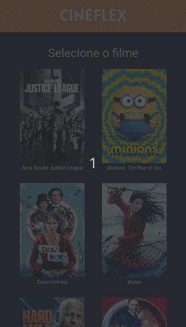

<p align="center" width="300px">

</p>
<p align="center">
  
  <a href="https://github.com/nathan4andrade/cineflex/commits/main">
    
  </a>
 </p>

<p align="center">
 <a href="#-sobre-o-projeto">Projeto</a> •
 <a href="#-funcionalidades">Funcionalidades</a> •
 <a href="#-layout">Layout</a> • 
  <a href="#-como-executar-o-projeto">Executar</a> • 
 <a href="#-tecnologias">Tecnologias</a> • <a href="#-autor">Autor</a> 
</p>

## 💻 Projeto

🎬 Cineflex - é um website em que o usuário pode agendar uma sessão de cinema no conforto de sua casa, trazendo mais praticidade e tecnologia para o seu lazer.

---

## ⚙️ Funcionalidades

- O usuário pode reservar uma sessão de cinema através dos seguintes passos:
  - [x] assim que o usuário entra no site são listados todos os filmes que estão em cartaz
  - [x] ao clicar em um filme, o usuário deve ser redirecionado para a página "/sessoes/(idFilme)", sendo (idFilme) o id do filme clicado, onde são exibidos os horários
  - [x] ao clicar em uma sessão, o usuário deve ser redirecionado para a rota "/assentos/(idSessao)", onde (dSessao) é o id da sessão escolhida, os assentos podem estar:
    - indisponíveis
    - disponíveis
  - [x] quando for escolhido um assento disponível ele será selecionado, pode-se escolher mais de um
  - [x] não sendo obrigatório inserir o nome e cpf, poderá clicar em "Reservar assento(s)", o usuário será redirecionado para a rota "/sucesso". Isso fará com os assentos marcados fiquem indisponíveis para outras marcações.
  - [x] nesta tela poderá retornar para página inicial com a listagem de filmes
  - [x] a todo momento, exceto na página inicial pode-se retornar para página anterior com o botão "voltar"

---

## 🎨 Layout

O layout somente para Mobile da aplicação está disponível no Figma:

<a href="https://www.figma.com/file/UDcJB1TS9mNgaKlnChCfyK/Cineflex?type=design&node-id=0%3A1&mode=design&t=vzmbenfvLAoCUD3f-1">

</a>

### Mobile

<p width="300px">

</p>

---

## 🚀 Como executar o projeto

Você pode somente acessar a [página](https://cineflex-nathan4andrade.vercel.app/) ou instalar na sua máquina como seguem as instruções a seguir:

### Pré-requisitos

Antes de começar, você vai precisar ter instalado em sua máquina as seguintes ferramentas:
[Git](https://git-scm.com), [Node.js](https://nodejs.org/en/).
Além disto é bom ter um editor para trabalhar com o código como [VSCode](https://code.visualstudio.com/)

#### 🧭 Rodando a aplicação web (Front-end)

```bash
# Clone este repositório
$ git clone git@github.com:Nathan4Andrade/cineflex.git
# Vá para a pasta da aplicação e instale as dependências
$ npm install
# Execute a aplicação em modo de desenvolvimento
$ npm run dev
# A aplicação será aberta na porta:5173 - acesse http://localhost:5173
```

---

## 🛠 Tecnologias

As seguintes ferramentas foram usadas na construção do projeto:

<p align="center">
<a src="https://reactjs.org/">
 </a> <a src="https://github.com/ReactTraining/react-router/tree/master/packages/react-router-dom"></a> <a src="https://styled-components.com/"></a>
 <a src="https://axios-http.com/"></a>  
</p>

> Veja o arquivo [package.json](./package.json)

---

## 🦊 Autoria

<a href="https://www.linkedin.com/in/nathanandradehenriques/" >
 
 <p>Nathan Andrade</p>
</a>
